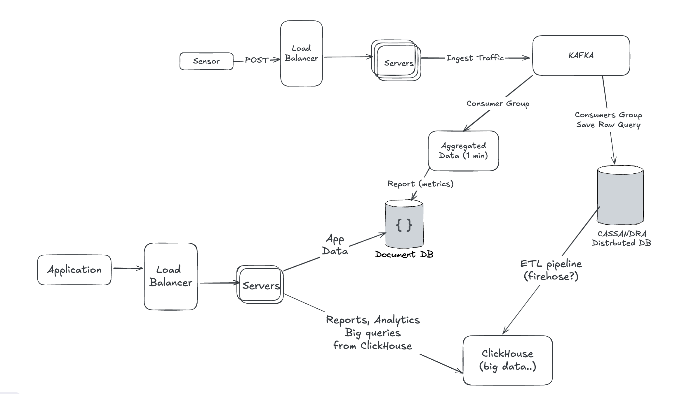

# High Traffic Ingestion API

This is a backend system designed to handle **high-throughput sensor data** sent from equipment deployed across various client sites. Each equipment can host **hundreds of sensors**, transmitting frequent metrics, which creates substantial ingestion traffic.

---

## 💡 Key Design Choices

### 1. **Cassandra for Raw Writes**

- All sensor data is saved _as-is_ into Cassandra for:
  - Full historical traceability
  - Future reprocessing or reconciliation

### 2. **Kafka for Load Buffering**

- API servers publish sensor readings to Kafka immediately after lightweight validation.
- Kafka decouples ingestion from processing.

### 3. **MongoDB for Aggregated Reports**

- Aggregated sensor readings (e.g., every minute) are saved into MongoDB Reports.
- This is the primary source for dashboards and near-real-time visualizations.

### 4. **ETL for OLAP**

- A separate ETL job fetches data from Cassandra and moves it to ClickHouse for analytical workloads and dashboards.

---

## 🧪 Tech Stack

| Purpose            | Tool              |
| ------------------ | ----------------- |
| API / Validation   | Node.js + Express |
| Raw Storage        | Cassandra         |
| Aggregated Reports | MongoDB           |
| Ingestion Queue    | Kafka             |
| Heavy Analytics    | ClickHouse        |
| Process Manager    | PM2               |
| Deployment         | Docker + Compose  |

---

| Process Name | Script                              | Instances |
| ------------ | ----------------------------------- | --------- |
| API          | build/app.js                        | 2         |
| kafka-raw    | build/consumers/kafkaToCassandra.js | 3         |
| kafka-report | build/consumers/kafkaToMongo.       | 1         |
