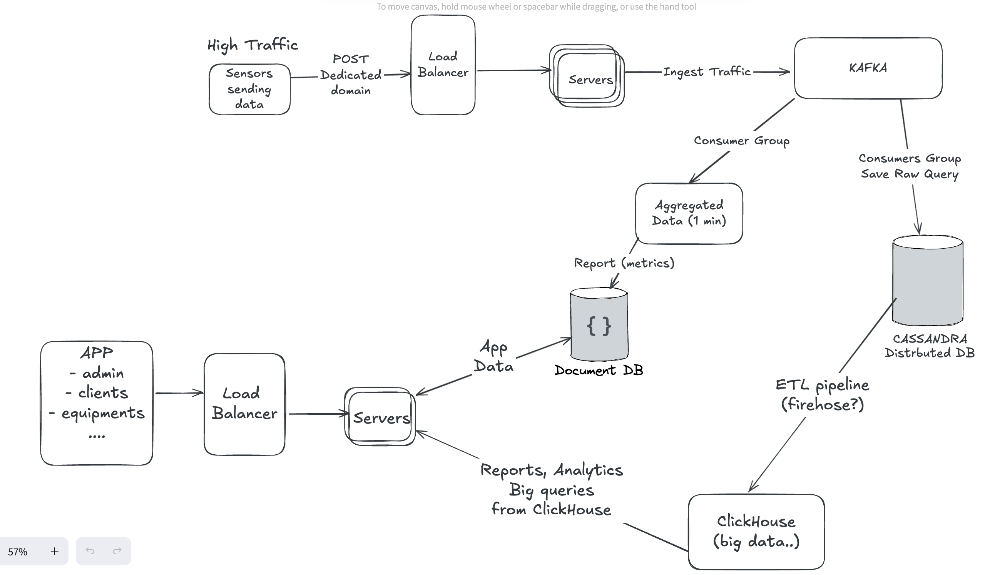

# High Traffic Ingestion API

This backend system is designed to handle **high-throughput sensor data** sent from equipment deployed across various client sites. Each equipment can host **hundreds of sensors**, transmitting frequent metrics that generate substantial ingestion traffic.

---

## 💡 Key Design Choices

### 1. **Cassandra for Raw Writes**

- All sensor data is saved _as-is_ into Cassandra for:
  - Full historical traceability.
  - Future reprocessing or reconciliation.
- **Why Cassandra instead of MongoDB?**  
  The choice is deliberate—**Cassandra's distributed, peer-to-peer architecture** is better suited for high-ingestion workloads. It offers:
  - Fast, scalable writes with minimal coordination.
  - Linear horizontal scalability.
  - Tunable consistency, allowing us to prioritize availability and performance over strong consistency where appropriate.

### 2. **Kafka for Load Buffering**

- API servers perform lightweight validation and publish sensor readings to Kafka.
- Kafka decouples ingestion from processing, acting as a durable, high-throughput buffer.

### 3. **MongoDB for Aggregated Reports**

- Aggregated sensor readings (e.g., per minute) are stored in MongoDB as Reports.
- This is the primary source for dashboards and near-real-time visualizations.

### 4. **ETL for OLAP (ClickHouse)**

- A separate ETL job fetches data from Cassandra and loads it into ClickHouse.
- ClickHouse powers historical analytics dashboards and large-scale aggregations.

---

## 🧪 Tech Stack

| Purpose            | Tool              |
| ------------------ | ----------------- |
| API / Validation   | Node.js + Express |
| Raw Storage        | Cassandra         |
| Aggregated Reports | MongoDB           |
| Ingestion Queue    | Kafka             |
| Heavy Analytics    | ClickHouse        |
| Process Manager    | PM2               |
| Deployment         | Docker + Compose  |

---

## ⚙️ Running Processes

| Process Name       | Script                                              | Instances |
| ------------------ | --------------------------------------------------- | --------- |
| API                | build/app.js                                        | 2         |
| mongo-consumer     | build/consumers/kafkaToCassandra.js                 | 3         |
| cassandra-consumer | build/consumers/kafkaToMongo.js                     | 1         |
| clickhoust-etl     | build/etl-reports/cassandraToClickHouse.pipeline.js | 1         |

---

